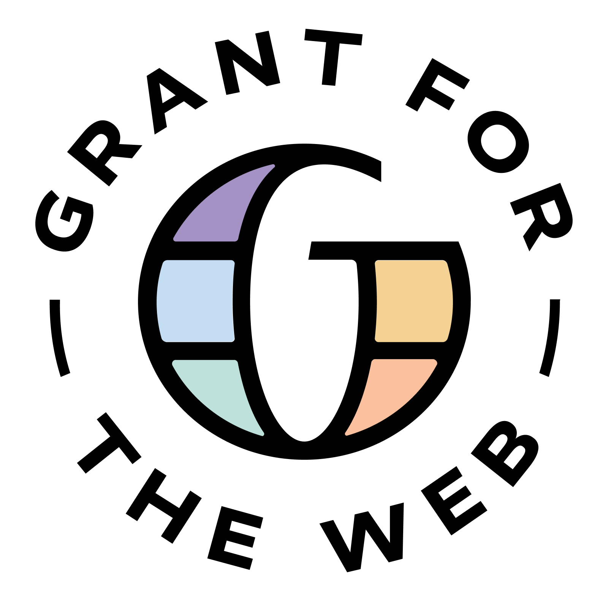
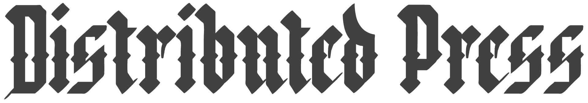
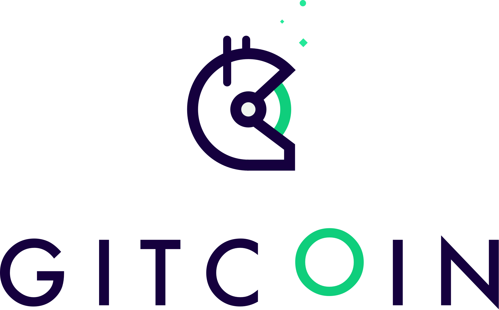

---




## ･༓☾our other projects + writings☽༓･ 

### ░t░a░l░
```
https://www.atm-magazine.com/
```

### Ż₳𝐜𝕙
```
https://coolguy.website/
https://solarpunk.cool/
```

### ᔕᕼᗩᖴᗩᒪI
```
https://open.janastu.org/
https://blog.janastu.org/
```

### ϻ𝔦𝐂αн
```
https://khattamicah.online/
https://medium.com/micah-alex/
https://thelivinglabs.net/
```

### ⓐⓝⓝⓘⓔ
```
http://annie-howard.com/
```

### ʍǟɨ
```
https://maisutton.net/
https://getdweb.net/
```

## SHOUT OUTS ＼(￣▽￣)／

thank you jennifer seaman cook for embarking on this journey with us!

what would we do without you, dawn walker? your support + wisdom has been invaluable.

big s/o to maggie oates for adding alt texts to all the images on this site and making it more accessible <3

benny lichtner you're incredibly talented and patient. we couldn't have done this without the long hours you put in!

hanami sutton, you made this site look so good. you got what we were going for and executed it so beautifully. you are what we call a pro.

jasmine ou, thank you for the amazing cover image! once we had that, the design was smooth sailing from there.

thanks rangermauve for your 12am hypercore + js tutorials.

shout out to fauno from sutty, for trying out distributed press since pre-alpha. we look forward to more collaborations ;)

high five to boris mann, our first monthly contributor on open collective! you're way ahead of the curve.

to harsha: you weren't mentioned in the piece about Just Constellations, but it wouldn't have happened without you. thanks for being such a good friend and collaborator <3

## ༓༝̩̩̥͙⊹ check these out ⊹༝̩̩̥͙༓

```
https://disco.coop/
https://magmacollective.org/
https://logicmag.io/
https://www.are.na/
https://newart.city/
https://alt-text-as-poetry.net/
https://www.memory-work.com/
```


## ＊✿❀ BIG thank you to our supporters + partners! ❀✿＊

<a href="https://hypha.coop" target="_blank"></a>
<a href="https://grantfortheweb.org" target="_blank"></a>
<a href="https://www.madebysuper.com" target="_blank"></a>
<a href="https://simplysecure.org" target="_blank"></a>
<a href="https://distributed.press" target="_blank"></a>
<a href="https://opencollective.com" target="_blank"></a>
<a href="https://webmonetization.org" target="_blank"></a>
<a href="https://gitcoin.co" target="_blank"></a>


⋇⋆✦⋆⋇ _end_ ⋇⋆✦⋆⋇

---
