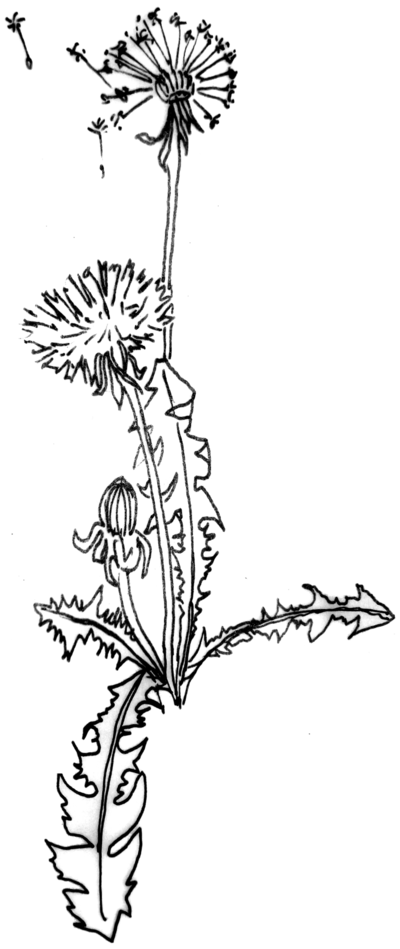


  
 <figure class="has-shadow">
    
	<figcaption>
Image via magma collective
</figcaption>
  </figure>


_Two dandelion seeds float on a gentle summer breeze. One settles in an open meadow, another is blown across a fence into a flower patch._

In peer-to-peer networks, we ‘seed’ for one another. We spread our bytes like weeds, criss-crossing fenced-in property and open meadows alike, in our effort to grow digital abundance .

Energies toward peer-to-peer decentralisation are rising again. Riding this fresh breeze, we wonder if these nature analogies can lift us away from the monocultures of platform giants towards a flourishing technological biodiversity.

This experimental essay explores the similarities between the client-server network architecture and the historical expropriation of the commons, both of which forced the creation of a working class and moneyed intermediation.



## Stolen Lands

In England, over the course of a few centuries, lands that were held and cared for by communities in common were expropriated, fenced in and enclosed as private property to be owned by a small elite . This process of transforming shared interdependent ecologies into separate, scarce and privately owned ‘things’ was encoded into property law and violently exported across the world in a continuous and unceasing process of colonisation.

What is tragic is not the commons . It’s the fact that so many of us are forced to adopt such protocols of private property, in order to protect ourselves from each other under conditions of proliferating mistrust.

Though the mistrust is valid. In the realm of digital technology, it is commonly known that today’s tech giants have built much of their empires on a code commons . The open meadows of collaboratively written code and generously shared repositories, published under permissive licences, are treated as fair game — and fenced off into proprietary products. But now more as bait to capture into monopoly services . How can I prevent my work from being expropriated without care if I don’t put a price on it? Must we guard our gardens with fences?

This is perhaps one of the reasons that the recent generation of peer-to-peer technologies are overwhelmingly about determining and enforcing forms of digital scarcity and private property through blockchains and smart contracts: to protect our efforts, creations and communities against expropriation. Now we are liberated to make private property of our own data before it enters the market — a depressing response to data extractivism. Won't using the master's tools reflect back an oppressive system through a splintered mirror? Proliferating property relations, forcing the conditions for monetisation across every click, packet switch, and interaction?  Or will decentralisation and peer-to-peer technologies produce a rich enough ground to grow new forms of economies? The popular imagination seems stuck in taking revenge on the system by zealously surpassing it in new get-rich-fast games. “Have fun staying poor”, as bitcoiners like to say in the latest bitrush. This is hardly a call for change in a world tumbling into unprecedented inequalities.

_The first seed landed in the meadow and took root, flowering amongst the wild grasses._

_The second seed began its germination but withered when one Wednesday afternoon, weed killer was sprayed across the beds. This bed was for tulips only you see, meant to be cut next Monday and sold in the latest tulip frenzy._

The commons are cared for by the those that directly inhabit and gain from its wealth. But these are repeatedly fenced in, the soils stolen for monocultures, monocrops, monobytes, streamlined by singular metrics of value. Who cares about the wild lands and the living when you can sell tulips! 



## Unwilding: from meadows to monocultures

The digital commons are only just emerging. But they should already have been thriving. When the internet first came along it looked like an immensely liberating tool, poised to rebalance the power brought about by the press and consolidation of media ownership. People thought the internet would finally evolve the topology of information networks: from one-to-many to many-to-many.

Anybody was able to host a website which would be accessible to the whole world. "Hello world!" we said, in anticipation of the abundant information commons the web would unleash. The commons would be free and liberating, impossible to dominate and control. But instead the internet gave rise to a small number of tech giants, with powers dwarfing print and broadcast media. Not only were these tech superpowers unshackled by geographical borders to reach audiences, the switch from one-way to two-way communication became a mechanism of mass coercion.

Why did this tool, which allowed everybody to talk to everybody else, not lead to the creation of a thriving biodiversity of digital commons? How did giving everybody a voice open the door to data extractivism and digital monopoly monoculture?

Power, politics, and plenty of other widely written about answers have been suggested. But our interest here is in the role of the client-server network model. Herein lies some of the technical context for how the network, digital and data commons have been born into servitude.

In the early days of the World Wide Web, websites generally hosted content which was created by the people who set up the website. The client-server model made sense. Viewers interested in particular content, connected directly to the content creator’s website. In the era of the dot-com boom and early e-commerce, a website of a particular company generally offered products and services provided by that company. But with the advent of web platforms, the 'clients' of a website came to both provide and receive content, or in the case of e-commerce platforms, 'clients' can offer products and services as well as consume them. The platform itself provides a way for people to find each other, linking content creators with those who are interested or connecting sellers with buyers. Popular platforms tend to get even more popular over time, network effects kicked in as clients choose those platforms that expose them to a wider audience. Although hosting more users means higher operating costs to run expansive infrastructure, a variety of business models have proved to work well with this model, including fees and subscriptions, advertising and selling users' data. The tendency towards fewer and bigger platforms, combined with these incentives, has reduced the diversity of control of how the platforms operate.

The resulting monocrop condition of our network infrastructures do not provide an easy ground for peer-to-peer technologies to flourish. Peer-to-peer protocol biodiversity is dosed with weed killer, while the client-server monocrop is fertilized.



#### Servers are easy to find and connect to

The IP address space is limited, and home internet connections are often given dynamic (changing) IP addresses. This gave many of us our inferior role as 'clients'. We can consume services but not provide them, as we are not addressable to others. Furthermore, Network Address Tables (NAT) are very often used by routers to allow a number of devices in the home to share the same IP address. These factors make it very difficult to reliably connect to a home computer directly over the internet.

_And yet, peer-to-peer is putting cracks in the concrete:_
There are solutions to the problems around NAT traversal and peer discovery. A number of techniques exist for 'hole-punching' network address tables, in order to allow connections to be made between two computers, neither of which are directly connected to the internet. These generally rely on having some sort of 'rendez-vous server' used in order for the NAT to allow the connection. That is to say, the technique only works with 'help' from a server which is not behind a NAT, which means that although the server's role is minimal, it does not give us complete independence. However, techniques for peer discovery, such as distributed hash tables (DHTs) and 'gossip protocols' mean that we have a lot of flexibility about which server is used. We can have a dynamic 'pool' of cooperative servers, meaning the server we happen to use does not constitute a single point of failure. This minimises the degree of power the server operators have over the network.



#### Asymmetrical bandwidth

Connections to private homes generally have greater download bandwidth than upload bandwidth. This means that you can get information from a data centre faster than you can get it from your neighbour. With the popular protocol HTTP, client requests tend to be small in comparison to server responses. So narrow upload bandwidth hinders people from serving content themselves.

_And yet, under the concrete and in between the cracks, new life is growing:_
Multiple-source 'swarming', as is used by peer-to-peer protocols like BitTorrent, can overcome the problem of asymmetrical upload/download bandwidth. By having a way of referring to an online resource other than by its physical location, it is possible to retrieve a single resource from sources in several physical locations. This means even those with limited bandwidth and low quality hardware can play a part in delivering data very quickly, because different parts can be delivered simultaneously from various locations.



#### Clients are getting thinner

Increasing popularity of lightweight devices means more computing and storage is outsourced to central servers and data centres. Although the early years of home computing saw a swift rise in the storage capacity available to the average user, this trend was reversed. The demise of the desktop computer, the shift from rotating platter disks to solid state drives, and the introduction of mobile and tablet computing, all meant that we were more likely to store and retrieve data from a server in a data centre than from a device in our own home. The mobile platform is by far the most accessible form of home computing (you don’t even need a home), but it's also the one that leaves you most vulnerable to coercion as it requires storage capacity and computing power to be outsourced.

_With care, light, nourishment, and time, these will grow into a new wilderness:_
The shift toward lightweight computing has generally made peer-to-peer systems impractical, as consumer devices are designed to outsource their storage and other resources in favour of being compact. However, some developments in lightweight consumer hardware are actually very well suited to peer-to-peer. Modern ARM devices, such as the Raspberry Pi, offer a low-cost, efficient solution for self-hosting. They generally consume very little power, making it practical to run them continuously, and can often be connected to high capacity disks. Most importantly, these devices are generally designed to make it easy to change the operating system or firmware, giving great flexibility in how they can be used.

Perhaps most significantly, cryptographic techniques allow us to verify the integrity of data regardless of where it is hosted. This opens the door to more collaborative 'consumer-provider' models of hosting, reducing our dependence on data centres and encouraging cooperative relationships between organisations.

The infrastructure favours the client-server model. It may be called the "client-server" model, but most of us clients aren't really looking to connect to a "server." What we want is to connect to a website. More accurately, we want to connect to friends or content. This desire for connection however is currently owned by platform giants rolling out huge server farms that harvest the world for data, while we are held captive, force-fed through feeds.



## Rewilding the Network Commons

We have drifted away from the idea of a website being the self-published expressions of a group or an individual. Instead, we have landed in the monopoly monocrops: malls and concrete pavements of large technology platforms. The 'server' no longer represents content creators that ‘clients’ are intending to connect to. Actually, clients are usually looking for each other, but begrudgingly connecting to a server farm, with users connecting to platforms and communicating indirectly.

In contrast, the peer-to-peer model turns addicted 'users' into active peers, giving people more control over the systems they use. This could also greatly reduce energy usage, as less devices are required to run collaborative applications. Private property necessitates monetisation, but a process of digital rewilding might help create diverse forests of digital wealth and plenty, unmediated by property and money relations. Yes, this was tried in the first iteration of peer-to-peer hopes of a post-scarcity world of plenty. What is different this time around is that we know that governance and the sustainability of our energy and efforts matter.

This is a call to extend the peer-to-peer glossary and imagination — towards a digital wild. We are already _seeding_ for one another. What about _seed banks_? There have been efforts to try to ensure that not only the most popular seeds survive. Let's call these _seed banks_, where the more rare gems are maintained and passed on as generational wealth. Can we take inspiration from the radical histories of seed banks and, say Amaranth, to develop these further? 

Biological terminology has also been appropriated in our current economic systems: _growth_ is a term that has been contorted into a singular metric of quantity that all too frequently and systematically destroys diversity. Can we reconfigure growth to mean richness in difference? Flourishing interdependent diversity of networks, network protocols and forms of interaction? What does this mean for digital _decay_, and can the decay of files, applications and networks become some form of _compost_, or what might be the most dignified form of digital death and rebirth?

We are living a rebirth of peer-to-peer in a more mature form, acknowledging that sustainability matters and economic ideas need to be rethought to once again serve rather than poison the wild. Private property necessitates monetisation, but a process of digital rewilding might help create diverse forests of digital wealth unmediated by property and money relations. Peer-to-peer applications cannot be monetised in the same way traditional client-server applications can. They require radically different business models and require us to change our habits and ways of thinking. Perhaps new alliances and inspirations can form between the biological and technological, towards flourishing diversity and difference.



