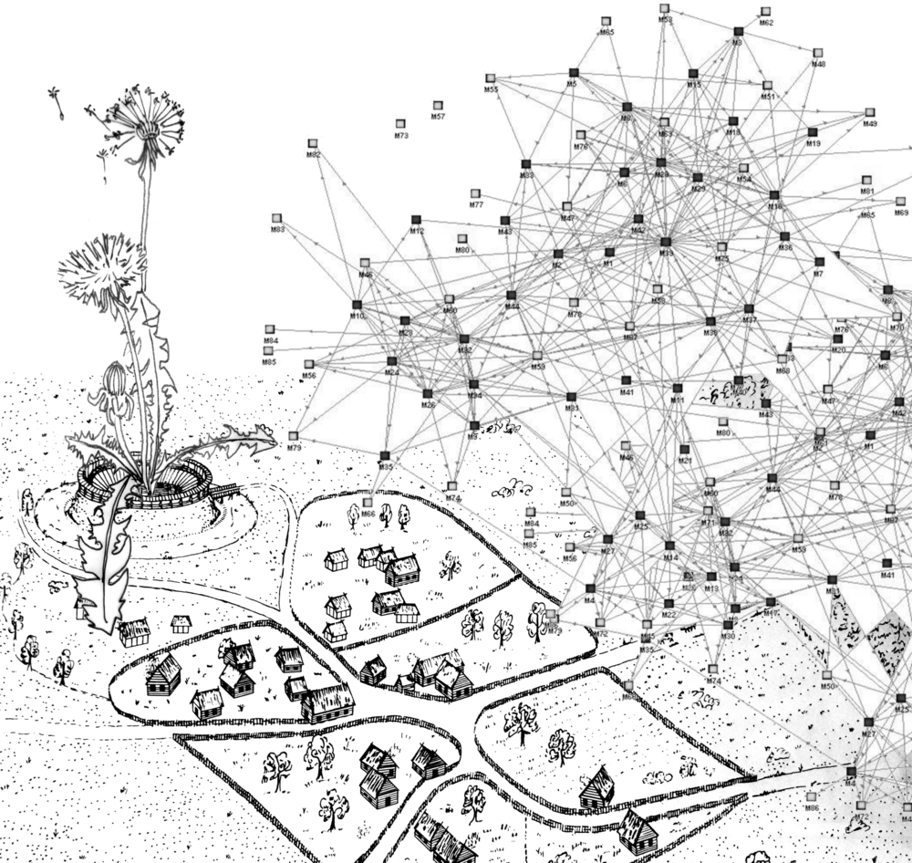
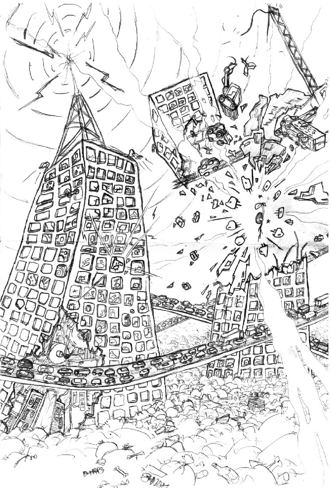
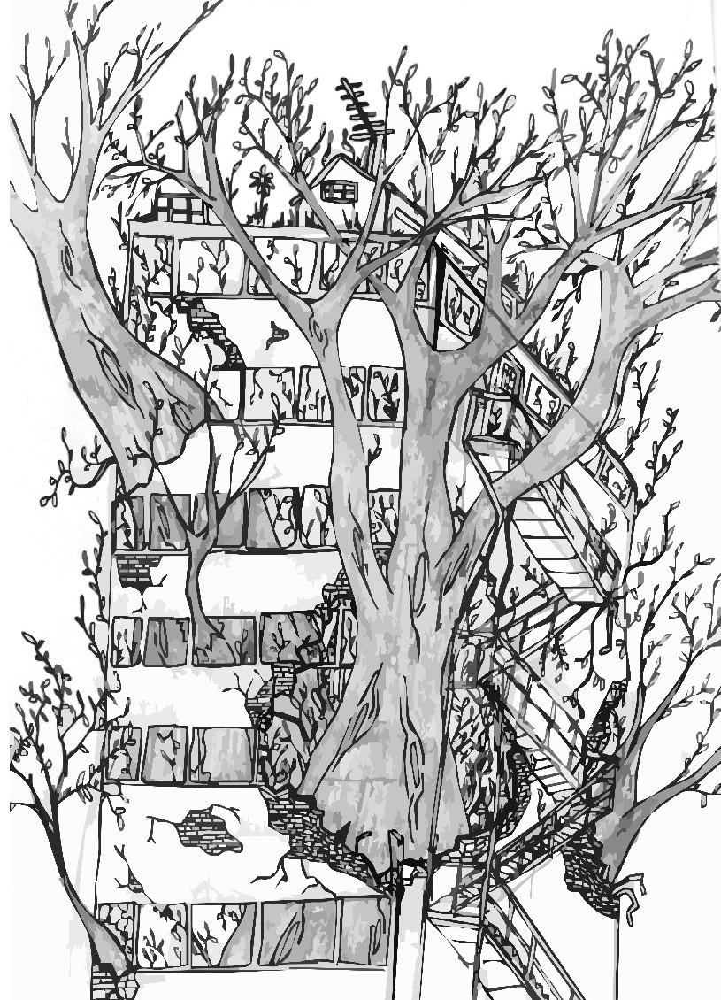

*Two dandelion seeds are floating on a gentle summer breeze. One settles in an open meadow, another is blown across a fence and into a flower patch.*

In peer-to-peer networks, we ‘seed’ for one another. We spread our bytes like weeds, criss-crossing fenced in property and open meadows alike, in efforts to grow digital abundance. 

The energies towards peer-to-peer decentralisation are rising again. Riding this fresh breeze, we wonder if these nature analogies can bring us across the monocultures of platform giants towards a flourishing technological biodiversity.

The following is an experimental exploration of the similarities between the client-server network architecture and the historical expropriation of the commons, which forced the creation of a working class and moneyed intermediation. 

## Stolen Lands
 
In England, over the course of a few centuries, lands that were held and cared for by communities in common were expropriated, fenced in and enclosed as private property to be owned by a handful of individuals [1]. This process of transforming shared interdependent ecologies into separate, scarce and privately owned ‘things’ was encoded into property law and violently exported across the world in a continuous unceasing process of colonisation. 

What is tragic is not the commons [2]. It’s the fact that so many of us are forced to adopt such same protocols of private property in order to protect ourselves from each other under conditions of proliferating mistrust. 

The mistrust is not without reasons. In the realm of digital technology, it is commonly known that today’s tech giants have built much of their empires on a code commons. The open meadows of collaboratively written code and generously shared repositories is treated as fair game for fencing off into new products and services. How can I prevent my efforts being taken for granted and expropriated without care if I don’t put a price on it, guarding my own gardens with fences? 

This is perhaps one of the reasons that the recent generation of peer-to-peer technologies are overwhelmingly about determining and enforcing forms of digital scarcity and private property and through blockchains and smart contracts: to protect our efforts, creations and communities against expropriation (using the tools of the master, so to speak). But “own your data” sounds a depressing response to data extractivism. Will such efforts merely be a splintered mirror of the masters methods? Proliferating property relations across every click, packet switch and interaction? 

“Have fun staying poor” (as bitcoiners like to say in the latest bitrush) is hardly a call for change in a world tumbling into unprecedented inequalities. 

*The first seed landed in the meadow and took root, flowering amongst the wild grasses.* 

*The second began its germination but withered when one Wednesday afternoon weed killer was sprayed across the beds. This bed was only for tulips only you see, meant to be cut next Monday and sold in the latest tulip frenzy.* 

The commons are cared for by the those that directly inhabit and gain from its wealth. But these are repeatedly fenced in, the soils stolen for monocultures, monocrops, monobytes, streamlined by singular metrics of value. Who cares about the wild lands and the living when you can sell tulips!

## Unwilding: from meadows to monocultures

The digital commons are only just emerging. But they should have already existed. When the internet first came along it looked like an immensely liberating tool, poised to rebalance the power brought about by the press and consolidation of media ownership. People thought the internet would finally evolve the topology of information networks: from one-to-many to many-to-many. 

Anybody was able to host a website which would be accessible to the whole world, “Hello world!” This was supposed to unleash an immense potential for the creation of information commons. These would be free and inherently difficult for anyone, even the most powerful, to dominate and control. But this is not what happened. The Internet gave rise to a small number of tech superpowers, with capabilities dwarfing those of both printed and broadcast media. Not only were they unhindered by geographical limitations to reach their audiences, the switch from one-way to two-way communication turned out to be a greater mechanism of mass coercion than ever before. 

Why did this tool, which allowed everybody to talk to everybody else, not lead to the creation of a thriving biodiversity of digital commons? How did giving everybody a voice open the door to data extractivism and digital monopoly monoculture? 

Power, politics and plenty of other widely written about answers have been suggested to these questions. But our interest here is in the role of the client-server network model. Herein lies some of the technical context for how network, digital and data commons have been born into servitude.

In the early days of the World Wide Web, websites generally hosted content which was created by the people who set up the website. The client-server model made sense. Viewers interested in particular content, connected directly to the content creator’s website. In the era of the dot-com boom and early e-commerce, a website of a particular company generally offered products and services provided by that company. But with the advent of web platforms, the 'clients' of a website often both provide and receive content, or in the case of e-commerce platforms 'clients' can offer products and services as well as consume them. The platform itself provides a way for people to find each other, linking content creators with those who are interested, or sellers with buyers. Popular platforms tend to get even more popular over time, as clients choose those platforms that expose them to a wider audience. Although, more users means higher running costs as more infrastructure is required, a variety of business models have proved to work well with this model, including fees and subscriptions, advertising and selling user's data. The tendency towards fewer, bigger platforms, combined with these incentives, reduces the diversity of control of how the platforms operate.

The resulting monocrop condition of our network infrastructures do not provide an easy ground for peer-to-peer technologies to flourish. Peer-to-peer protocol biodiversity is dosed with weed killer, while the client-server monocrop is fertilized:

#### Servers are easy to find and connect to

The IP address space is limited, and home internet connections are often given dynamic (changing) IP addresses. This gave many of us our inferior role as 'clients'. We can consume services but not provide them, as we are not addressable to others. Furthermore, Network Address Tables are very often used by routers to allow a number of devices in the home to share the same IP address. These factors make it very difficult to reliably connect to a home computer directly over the internet. 

*And yet, peer-to-peer is putting cracks in the concrete:*
There are solutions to the problems around NAT traversal and peer discovery. A number of techniques exist for 'hole-punching' network address tables, in order to allow connections to be made between two computers, neither of which are directly connected to the internet. These generally rely on having some sort of 'rendez-vous server' used in order for the NAT to allow the connection. That is to say, the technique only works with 'help' from a server which is not behind a NAT, which means that although the server's role is minimal, it does not give us complete independence. However, techniques for peer discovery, such as distributed hash tables (DHTs) and 'gossip protocols' mean that we have a lot of flexibility about which server is used, we can have a dynamic 'pool' of cooperative servers, meaning the server we happen to use does not constitute a single point of failure. This minimises the degree of power the server operators have.

#### Asymmetrical bandwidth 

Connections to private homes generally have greater download bandwidth than upload bandwidth. This means that you can get information from a data centre faster than you can get it from your neighbour. With the popular protocol HTTP, client requests tend to be small in comparison to server responses. So narrow upload bandwidth hinders people from serving content themselves. 
 
*And yet, under the concrete and in between the cracks, new life is growing:* 
Multiple-source 'swarming', as is used by peer-to-peer protocols like Bittorrent, can overcome the problem of ansymmetrical upload/download bandwidth.. By having a way of referring to an online resource other than by its physical location, it is possible to retrieve a single resource from several sources in different physical locations. This means even those with limited bandwidth and low quality hardware can play a part in delivering data very quickly, because different parts can be delivered simultaneously from different locations.

#### Clients are getting thinner

Increasing popularity of lightweight devices means more computing and storage is outsourced to central servers and data centres. Although the early years of home computing saw a swift rise in the storage capacity available to the average user, this trend was reversed. The demise of the desktop computer, the shift from rotating platter disks to solid state drives, and the introduction of mobile and tablet computing, all meant that we were more likely to store and retrieve data from a server in a data centre than from a device in our own home. The mobile platform is by far the most accessible form of home computing (you don’t even need a home), but the one that leaves you most vulnerable to coercion, as it requires storage capacity and computing power to be outsourced.

*With care, light, nourishment and time, these will grow into a new wilderness:*
The shift toward lightweight computing has generally made peer-to-peer systems impractical, as consumer devices are designed to outsource their storage and other resources in favour of being compact. However, some developments in lightweight consumer hardware are actually very well suited to peer-to-peer. Modern ARM devices, such as the Raspberry Pi, offer a low-cost, efficient solution for self-hosting. They generally consume very little power, making it practical to run them continuously, and can often be connected to high capacity disks. Most importantly, these devices are generally designed to be easy to change the operating system or firmware, giving great flexibility in how they can be used.

Perhaps most significantly, cryptographic techniques allow us to verify the integrity of data regardless of where it is hosted. This opens the door to more collaborative 'consumer-provider' models of hosting, reducing our dependence on data centres and encouraging cooperative relationships between organisations.

The infrastructure favours the client-server model. It may be called the "client-server" model, but most of us clients aren't really looking to connect to a "server." What we want is to connect to a website. More accurately, we want to connect to friends or content. This desire for connection however is currently owned by platform giants rolling out huge server farms that harvest the world for data, while we are held captive, force-fed through feeds. 

## Rewilding the Network Commons

We have drifted away from the idea of a website being the self-published expressions of the group or individual who created it. Instead we have landed in the monocrops, malls and concrete pavements of large technology platforms. The 'server' no longer represents content creators that ‘clients’ are intending to connect to. Actually, clients are usually looking for each other, but begrudgingly connecting to a server farm, users connecting to platforms and communicating indirectly. 

In contrast, the peer-to-peer model turns addicted 'users' into active peers, giving people more control over the systems they use. This could also greatly reduce energy usage, as less devices are required to run collaborative applications.

Perhaps new alliances can form in efforts towards biodiversity. Do we have digital seed banks? What grows from these seeds? How do they decay? Do they form a compost that can enrich further growth? How can we ensure biodiversity? 

Extending the peer-to-peer glossary: 
*Seeding*
*Seed bank*
*Growth*
*Decay*
*Compost*
*Biodiversity*

There are ways around each of the technical barriers to the adoption of peer-to-peer systems. But there are also social barriers. Peer-to-peer applications cannot be monetised in the same way traditional client-server applications can. They require radically different business models and require us to change our habits and ways of thinking. 

## References

- https://www.thelandmagazine.org.uk/articles/short-history-enclosure-britain
- https://www.londonfreedomseedbank.org/the-radical-history-of-amaranth/
- https://collectiveliberation.org/wp-content/uploads/2013/01/Lorde_The_Masters_Tools.pdf
- Martin Kleppmann, Adam Wiggins, Peter van Hardenberg, and Mark McGranaghan. Local-first software: you own your data, in spite of the cloud. 2019 ACM SIGPLAN International Symposium on New Ideas, New Paradigms, and Reflections on Programming and Software (Onward!), October 2019, pages 154–178. https://www.inkandswitch.com/local-first.html
- Oram, Andy - Peer-to-Peer: Harnessing the Power of Disruptive Technologies - O'Reilly Media
- Blum, Andrew - Tubes: A Journey to the Center of the Internet - Ecco 2012
- Witt, Stephen - How music got free - a story of obsession and invention - 2016
- Cohen, Bram - Incentives build robustness in Bittorrent, 2003 https://www.bittorrent.org/bittorrentecon.pdf
- Ford, Bryan; Srisuresh, Pyda; Kegel, Dan (2005), Peer-to-Peer Communication Across Network Address Translators https://bford.info/pub/net/p2pnat/
